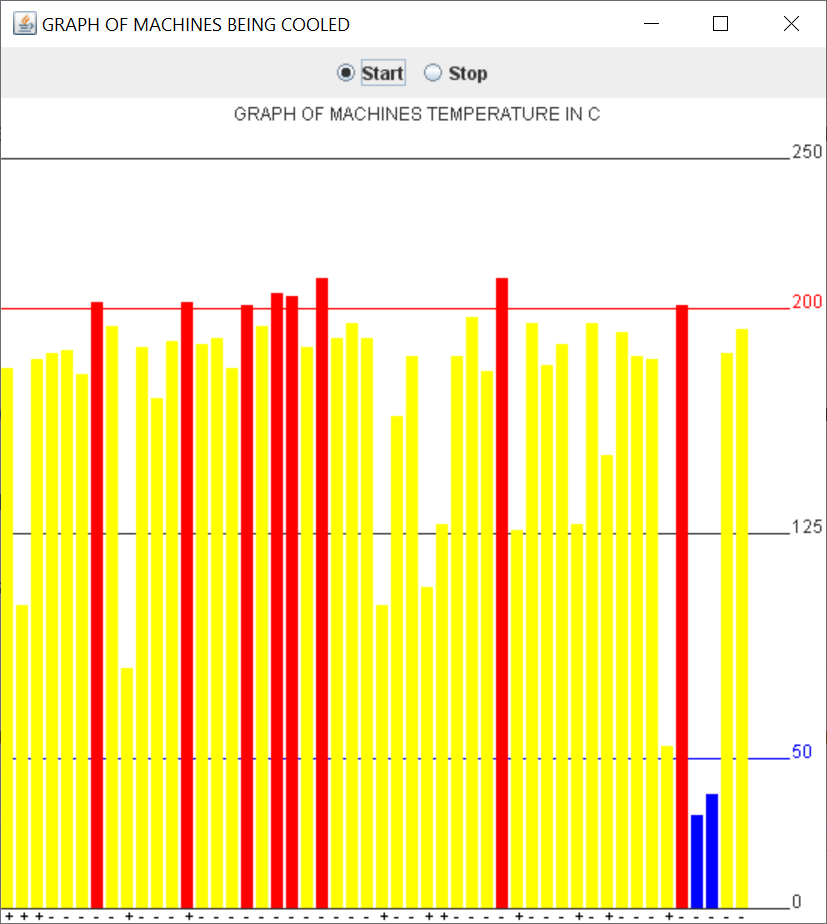

# Factory Control

A basic GUI to start and stop the machines at a factory. Also provides a visual representation of currently running machines and their temperatures. Red means the machine is overheated whereas blue means the machine is undercooled.

